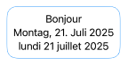

# Feedback FB18965357

## Xcode Preview: Formatter does not honor .environment(\.locale … )

In a SwiftUI preview, the locale set with  .environment(\.locale, .init(identifier: "fr")) is not honored by formatters, like DateFormatter or NumberFormatter. It would be good if parts of the view dependent on such formatters could be localized in the preview.

In the above image, the text is localized, but the first date is not. For the second date, the formatter has been explicitly initialized with a locale.
